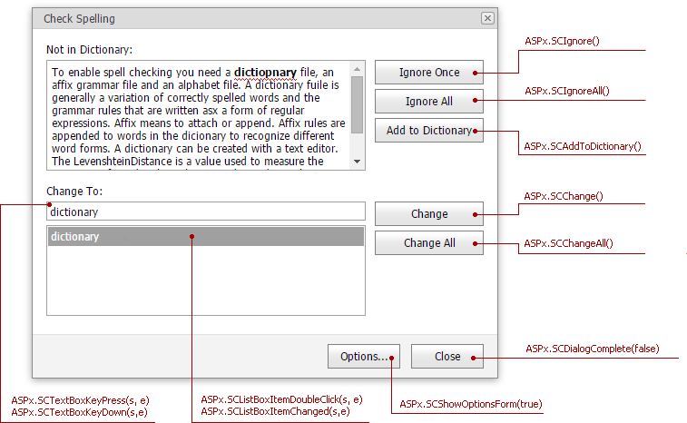
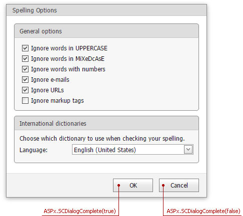

# ASP.NET MVC SpellChecker - Customize built-in dialogs

This example customizes built-in spell check dialogs in ASP.NET MVC Spell Checker.

## Implementation Details

The DevExpress ASP.NET MVC Spell Checker ships with two built-in forms:

1. **SpellCheckForm** allows users to accept/reject spelling suggestions and update a custom dictionary with new words.
2. **SpellCheckOptionsForm** allows users to configure spell check options.

To render custom **SpellCheckForm** and **SpellCheckOptionsForm**, use [SpellCheckerSettings.SettingsForms.SpellCheckFormAction](https://docs.devexpress.com/AspNetMvc/DevExpress.Web.Mvc.MVCxSpellCheckerFormsSettings.SpellCheckFormAction) and [SpellCheckerSettings.SettingsForms.SpellCheckOptionsFormAction](https://docs.devexpress.com/AspNetMvc/DevExpress.Web.Mvc.MVCxSpellCheckerFormsSettings.SpellCheckOptionsFormAction) properties:

```csharp
settings.SettingsForms.SpellCheckFormAction = "CustomSpellCheckFormPartial";
settings.SettingsForms.SpellCheckOptionsFormAction = "CustomSpellCheckOptionsFormPartial";
```

`CustomSpellCheckFormPartial` and `CustomSpellCheckOptionsFormPartial` actions render partial views that contain custom dialogs. These dialogs are identical to built-in ones. You can modify them as needs dictate using private client-side Javascript event handlers (see images below):

* `CustomSpellCheckFormPartial` view:  
    
* `CustomSpellCheckOptionsFormPartial` view:  
    

## Files to Review

* [HomeController.cs](./CS/SpellCheckerCustomDialogs/Controllers/HomeController.cs)
* [SpellCheckerHelper.cs](./CS/SpellCheckerCustomDialogs/Helpers/SpellCheckerHelper.cs)
* [CustomSpellCheckFormPartial.cshtml](./CS/SpellCheckerCustomDialogs/Views/Home/CustomSpellCheckFormPartial.cshtml)
* [CustomSpellCheckOptionsFormPartial.cshtml](./CS/SpellCheckerCustomDialogs/Views/Home/CustomSpellCheckOptionsFormPartial.cshtml)
* [Index.cshtml](./CS/SpellCheckerCustomDialogs/Views/Home/Index.cshtml)
* [IndexPartial.cshtml](./CS/SpellCheckerCustomDialogs/Views/Home/IndexPartial.cshtml)

<!-- feedback -->
## Does this example address your development requirements/objectives?

[](https://www.devexpress.com/support/examples/survey.xml?utm_source=github&utm_campaign=spellchecker-customizing-built-in-dialogs-t316492&~~~was_helpful=yes) [](https://www.devexpress.com/support/examples/survey.xml?utm_source=github&utm_campaign=spellchecker-customizing-built-in-dialogs-t316492&~~~was_helpful=no)

(you will be redirected to DevExpress.com to submit your response)
<!-- feedback end -->
